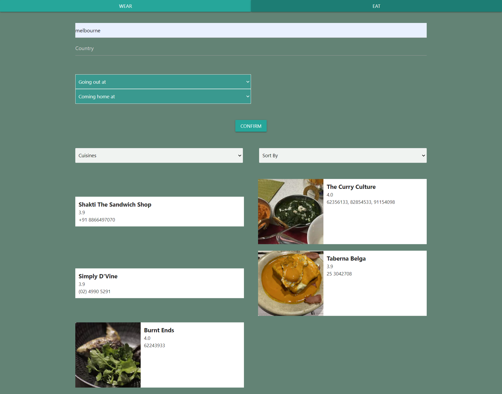
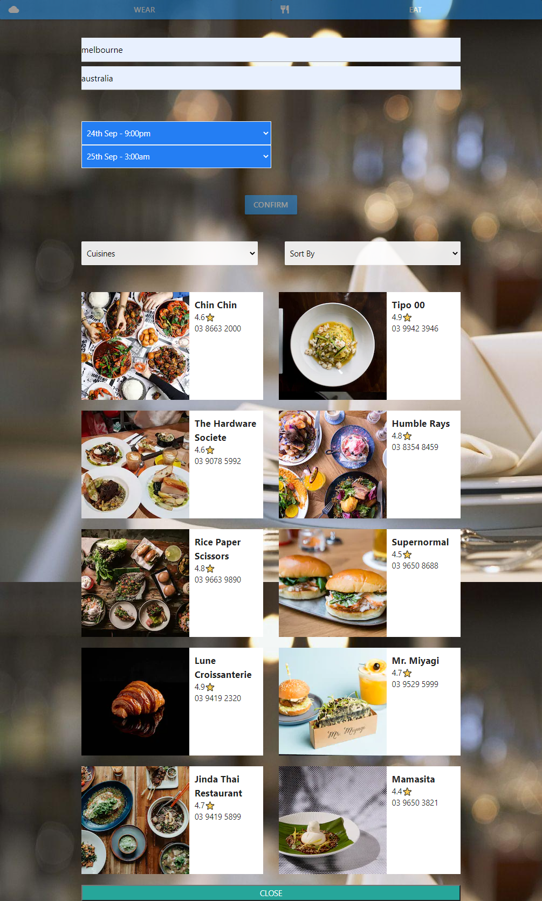

# WeatherWear

A JavaScript web app that helps you decide what to wear when you are going out depending on the current weather forecast. You can also look up places to eat in the local area whilst you are out.

## Description

Simply enter your location and use the drop down menus to select what time you are going out and what time you are expecting to coming home. WeatherWear will fetch the local weather information for the selected time period and find the average temperature. You will be presented with suggestions of what to wear or bring with you whilst you are out depending on the temperature and rainfall. Also features dynamic background images that shows an image in relation to the type of weather you will be facing that day.

WeatherWear also allows you to search for local places to eat in the area whilst you are out. The places-to-eat list can be filtered by cuisine type and ordered by rating or by cost.

This is app features a slick, easy to use interface and can be used for when you are abroad travelling or close to home. WeatherWear can help you plan your day for unexpected weather whilst making sure you don't go hungry.

## Third Party API's

The following third party API's are used to fetch the weather information and local restaurant information

- weatherbit: https://www.weatherbit.io/
- zomato: https://developers.zomato.com/api

## Deployed Link

## Screenshots

